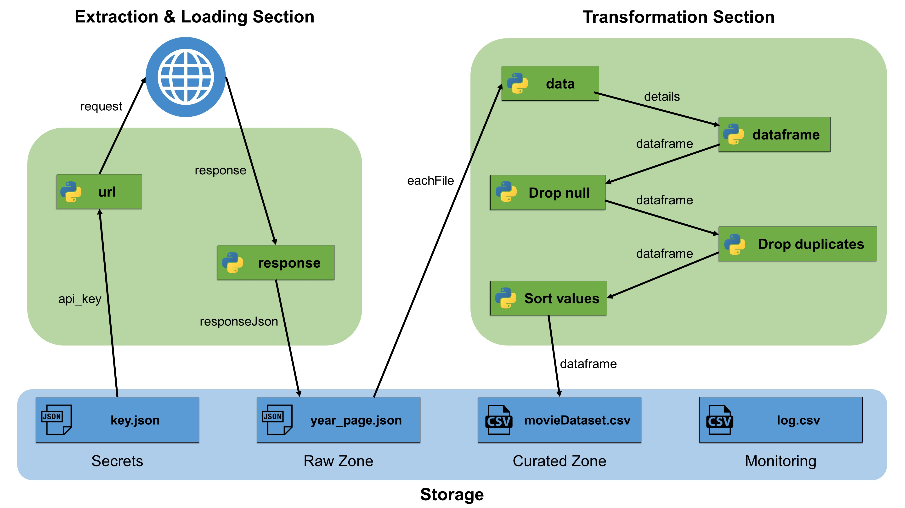
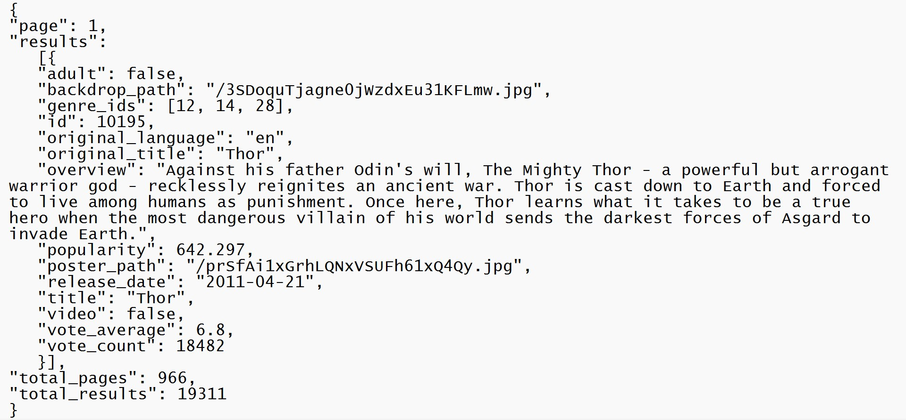
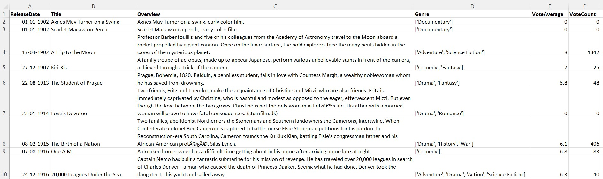
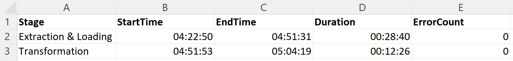

# Movie Data API Calls

## Tags

<code> Python </code> &nbsp;&nbsp; <code> Extract Load Transform </code> &nbsp;&nbsp; <code> API </code> &nbsp;&nbsp; <code> Monitoring </code> &nbsp;&nbsp; <code> Storage </code> &nbsp;&nbsp; <code> Secrets </code> &nbsp;&nbsp; <code> TMDB </code> &nbsp;&nbsp; <code> Movie Details </code>


<br>

## Architecture

<div align="center">
  
  <h6 align="center"><i> Architecture Diagram </i></h6>
</div>


<br>

## Overview

Movies are indeed a great source of knowledge, but how about analyzing the performance of your favourite movie?

While searching for a free API for movie data, I came across https://www.themoviedb.org/ . I explored the site and found that it has an API through which I can get the Movie details per page. So, I made iterative calls to the TMDB website, to get the content of the first 500 pages within a year range of 2012 to 2021. Then saved the response in a separate JSON file for each API call. For the Transformations part, I extracted the details from each of the JSON files and appended them to a pandas dataframe. Finally, I performed some data cleaning like removing nulls, removing duplicates, and sorting the values based on Release Date. I also maintained a log.csv file to monitor the execution and track the errors. 

<br>

## Detailed Approach

### Extraction & Loading section

Initially I loaded the **api_key** from the key.json file. Then I created a nested for loop to iterate over the first 500 pages within a year range of 2012 to 2021. For every page and year, I fetched the most popular movies from the below mentioned TMDB API and dumped it into a seperate json file within the Raw Zone. 

```python
"https://api.themoviedb.org/3/discover/movie?api_key=" + api_key + "&language=en-US&sort_by=popularity.desc&include_adult=false&page=" + str(page) + "&year=" + str(year)
```

A demo json file was shown below, which contains data of all the fields of a single movie from the 1st page of year 2012. The available fields were **adult**, **backdrop_path**, **genre_ids**, **id**, **original_language**, **original_title**, **overview**, **popularity**, **poster_path**, **release_date**, **title**, **video**, **vote_average** and **vote_count**. There were 5000 json files in the Raw Zone, but I uploaded only the first 100 files.

<div align="center" width=80%>
  
  <h6 align="center"><i> Demo JSON file </i></h6>
</div>

### Transformation section

Initialiiy, I created a blank dataframe with the following columns: **ReleaseDate**, **Title**, **Overview**, **Genre**, **VoteAverage** and **VoteCount**. Then I extracted the details from each of the JSON files and appended to the dataframe. 

Then I performed the following steps for data cleaning:
* Replace genre_id
* Drop NULLs
* Drop Duplicates
* Sort Values on ReleaseDate column

Finally, the output dataset was stored in the Curated Zone. The dataset contains the details of 60000+ popular movies, as shown below.

<div align="center" width=80%>
  
  <h6 align="center"><i> movieDataset.csv </i></h6>
</div>

### Monitoring section

I tried my best to replicate the Log analytics offerings by the popular cloud providers. Here, I stored the Stage name, Start time, End time, Duration and Error count of each of the script. 

The below image, shows the log of the latest execution. We can see that the Extraction & Loading of 5000 json files took 29 minutes whereas Transformations took 13 minutes.

<div align="center" width=80%>
  
  <h6 align="center"><i> log.csv </i></h6>
</div>

<br>
<br>

---

<br>

Please find the code at [Script directory](https://github.com/SandipPalit/Data-Engineering-with-Python/tree/main/Movie%20Data%20API%20Calls/Script) and the output dataset at [Kaggle](https://www.kaggle.com/datasets/sandippalit009/movie-dataset).

If you like this project, then please give it a ⭐.

Feel free to reach out to me on [LinkedIn](https://www.linkedin.com/in/sandip-palit/).

_**Happy Learning!!**_
