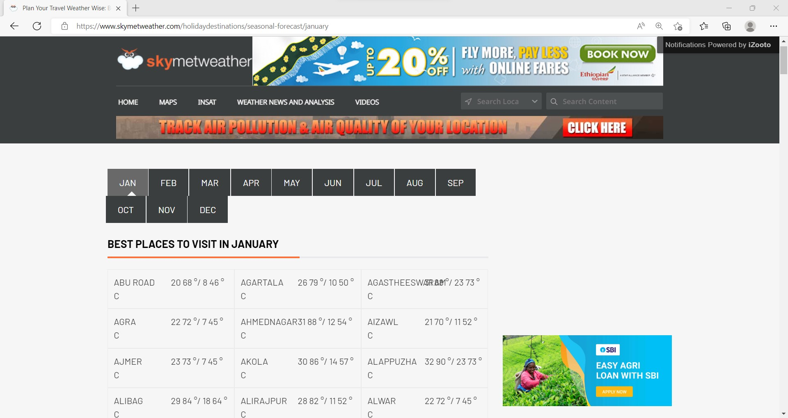
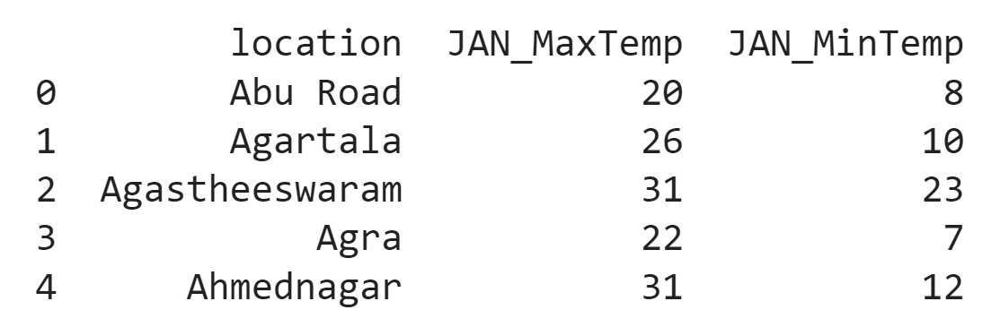
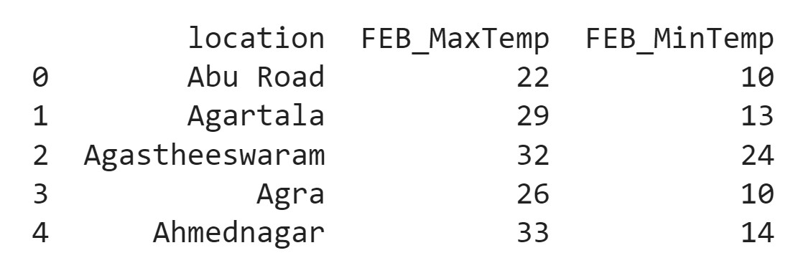
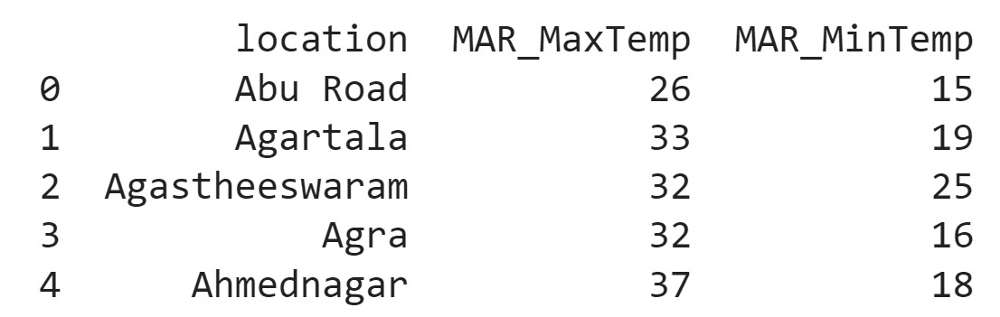
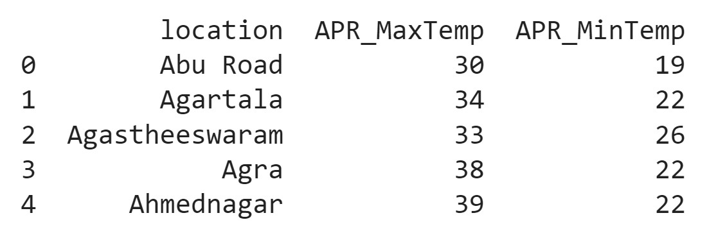
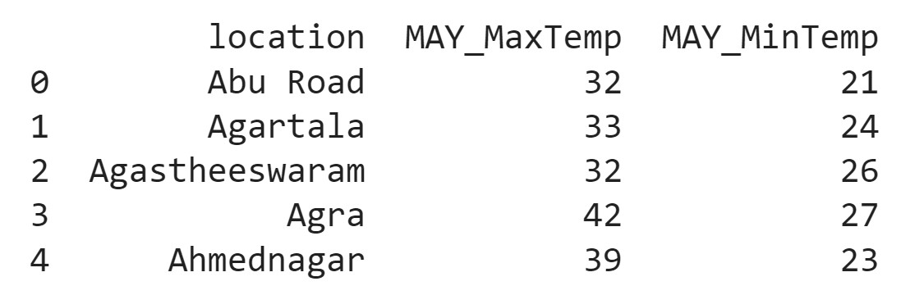
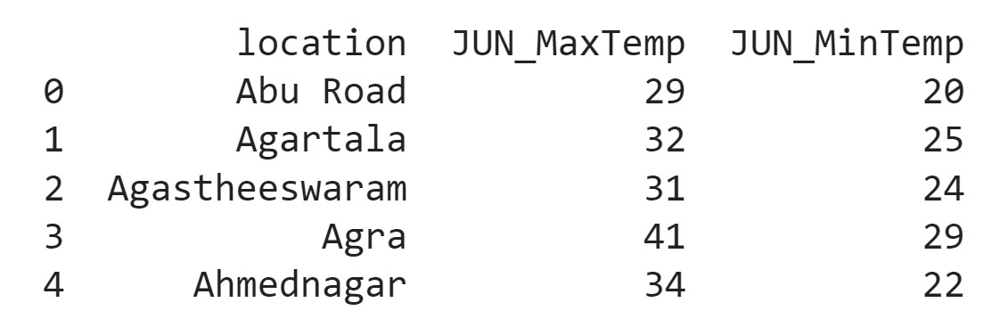
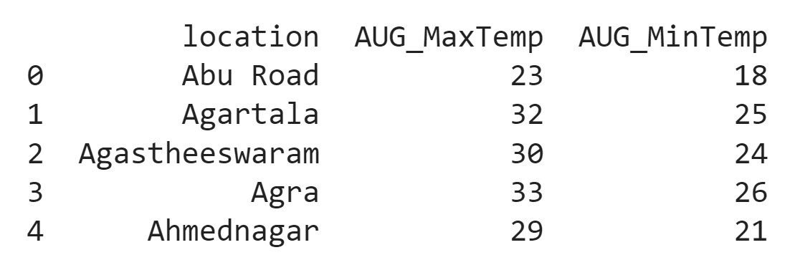
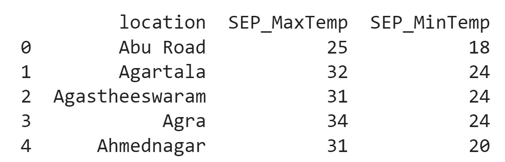
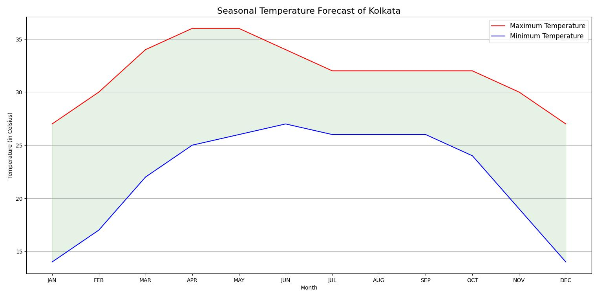

# Temperature Data Scraping

## Tags

<code> Python </code> &nbsp;&nbsp; <code> Extract Load Transform </code> &nbsp;&nbsp; <code> Web Scraping </code> &nbsp;&nbsp; <code> BeautifulSoup </code> &nbsp;&nbsp; <code> Database </code> &nbsp;&nbsp; <code> SQLite </code> &nbsp;&nbsp; <code> Visualization </code> &nbsp;&nbsp; <code> Matplotlib </code>


<br>

## Architecture

<div align="center">
  
  <h6 align="center"><i> Architecture Diagram </i></h6>
</div>


<br>

## Overview

Being a Traveller by heart, I know how weather or temperature plays an important role in our planning. So I was going through various websites to find the Seasonal variance of Temperature in various Indian travel destinations. Then I came across www.skymetweather.com and found that it will be the perfect source for web scraping. 

After scraping the website, I had a hard time finding the necessary pieces of information like Location, Maximum Temperature, and Minimum Temperature. Then loaded the data into the database in a structured way. I have created a different table for each month. Then I joined all the tables based on location to create master data. Finally, I visualized the Seasonal variance of Temperature by using Matplotlib.


<br>

## Detailed Approach

### Importing Necessary Libraries

I have developed this entire project using Python programming language, and I used the following libraries.
* _**requests**:_ The requests library is the de facto standard for making HTTP requests in Python. It abstracts the complexities of making requests behind a beautiful, simple API so that we can focus on interacting with services and consuming data in your application.
* _**bs4**:_ Beautiful Soup is a Python library for pulling data out of HTML and XML files. It works with our favorite parser to provide idiomatic ways of navigating, searching, and modifying the parse tree.
* _**sqlite3**:_ SQLite is a C library that provides a lightweight disk-based database that doesn’t require a separate server process and allows accessing the database using a nonstandard variant of the SQL query language.
* _**matplotlib**:_ Matplotlib is a plotting library for the Python programming language and its numerical mathematics extension NumPy.

### Ingesting Data and Loading data in the Database

<div align="center" width=80%>
  
  <h6 align="center"><i> Source Website (www.skymetweather.com) </i></h6>
</div>

I have Extracted useful pieces of information like Location, Maximum Temperature, and Minimum Temperature from the above-mentioned website through web scraping and stored that information in the database, in the following steps:
* Firstly, I have created a 'temperature_data' database using sqlite3 to store the extracted data.
* Now, for every month, I repeatedly executed these steps
    1. Created a new table in the database with the month name, like 'temperature_january'.
    2. Ingested the data from the internet through web scraping using the requests library of Python.
    3. Parsed the response data using BeautifulSoup's Html parser.
    4. As there were many locations in the data, so I iterated for each location. <br>
    &nbsp;&nbsp; ~ Extracted Location, Maximum Temperature, and Minimum Temperature.<br>
    &nbsp;&nbsp; ~ Inserted these values in the table.

### Transforming Data

<table>
  <tr>
    <td><h5 align="left"><i> temperature_january table </i></h5></td>
    <td><h5 align="left"><i> temperature_february table </i></h5></td>
    <td><h5 align="left"><i> temperature_march table </i></h5></td>
    <td><h5 align="left"><i> temperature_april table </i></h5></td>

  </tr>
  <tr>
    <td><h5 align="left"><i> temperature_may table </i></h5></td>
    <td><h5 align="left"><i> temperature_june table </i></h5></td>
    <td><h5 align="left"><i> temperature_july table </i></h5></td>
    <td><h5 align="left"><i> temperature_august table </i></h5></td>
  </tr>
  <tr> 
    <td><h5 align="left"><i> temperature_september table </i></h5></td>
    <td><h5 align="left"><i> temperature_october table </i></h5></td>
    <td><h5 align="left"><i> temperature_november table </i></h5></td>
    <td><h5 align="left"><i> temperature_december table </i></h5></td>
  </tr>
</table>


I did some minor transformations as I wanted to keep the data as original as possible. So I joined all the tables using Natural Join, using the following query. I have used natural join because all the tables have only one common column i.e., **Location** and I want to join on that column only. 

```sql
select * from temperature_january natural join temperature_february natural join temperature_march natural join temperature_april natural join temperature_may natural join temperature_june natural join temperature_july natural join temperature_august natural join temperature_september natural join temperature_october natural join temperature_november natural join temperature_december;
```

Firstly, I connected to the same database, that I used in the last step. Then I fetched the names of all the tables and dynamically generated the above-mentioned select clause. I fetched the output of the select statement and converted it into a pandas dataframe so that we can use it for visualization in the next step.

### Storing Data and Visualizing Data

For visualization purpose, I have chosen the 'City of Joy'. I iterated over the columns and stored the values of the maximum temperature columns in a maxTemp list, the values of the minimum temperature columns in a minTemp list and the month names in the month list. Then I generated the Line Chart with Maximum and Minimum temperatures in Y-axis and Months in X-axis.

<div align="center" width=80%>
  
  <h6 align="center"><i> Seasonal Variation of Temperature in Kolkata </i></h6>
</div>

<br>
<br>

---

<br>

If you like this project, then please give it a ⭐.

Feel free to reach out to me on [LinkedIn](https://www.linkedin.com/in/sandip-palit/).

_**Happy Learning!!**_
